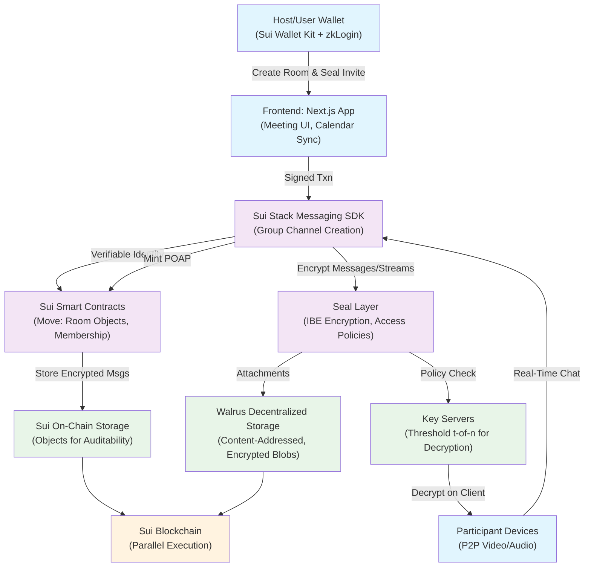

# SuiMeet: Decentralized Video Meetings on Sui Blockchain

Welcome to **SuiMeet**, a web3 meeting platform that combines Zoom-like video calls with the security and ownership of the Sui blockchain. Powered by **Sui Stack Messaging SDK** (alpha, Sep 2025) for end-to-end encrypted calls and **Seal** for wallet-based access control, SuiMeet lets hosts create secure rooms, invite via Sui addresses, and mint attendance NFTs—all while keeping data user-owned. Imagine private, auditable meetings with a web3 twist, no centralized servers required.

## Why SuiMeet?

SuiMeet redefines collaboration in a trust-first world:
- **Secure Access**: Hosts seal invites with Sui’s Seal SDK—only approved wallets join.
- **Seamless Calls**: P2P video/audio/chat with <100ms latency via Sui Stack Messaging.
- **Web3 Perks**: Mint POAP NFTs, sync invites to calendars, and audit via Sui Explorer.
- **Scalable**: Sui’s 10,000+ TPS handles 100+ participants effortlessly.

Perfect for DAOs, remote teams, or creators building private, monetizable meeting spaces.

## Features

- **Host-Controlled Rooms**: Create meetings, add Sui addresses, or approve guests via wallet signatures.
- **Encrypted Video/Chat**: Real-time calls and threaded chats, E2E encrypted with Sui Stack Messaging.
- **NFT Attendance Badges**: Auto-mint POAPs post-meeting, gated by Seal policies.
- **Calendar Sync**: Invites sync to Google/Outlook with one-click wallet verification.
- **Waiting Room**: Guests await host approval, with live participant counts.
- **Analytics**: On-chain metrics (e.g., attendance rate) without privacy leaks.

## Architecture

SuiMeet is a full-stack dApp leaning on Sui’s ecosystem:
- **Frontend**: Next.js 15 + Tailwind CSS for a responsive UI.
- **Calling Layer**: Sui Stack Messaging SDK (alpha) for P2P video/audio/chat.
- **Access Control**: Seal SDK for policy-based invites (time-bound, revocable).
- **Storage**: Walrus for decentralized file sharing (e.g., screen shares).
- **Blockchain**: Sui’s Move contracts for rooms, memberships, and POAPs.
- **Wallet**: Sui Wallet Kit + zkLogin for passwordless auth.

See the [architecture flowchart](#architecture-flowchart) for a visual overview.

## Prerequisites

- **Node.js**: v18+ for frontend development.
- **Sui CLI**: For Move contract deployment (`cargo install sui`).
- **Sui Wallet**: Browser extension for testnet/mainnet.
- **Git**: To clone and manage the repo.
- **Vercel Account**: For frontend deployment (optional).

## Setup Instructions

Get SuiMeet running locally in ~15 minutes:

1. **Clone the Repository**:
   ```bash
   git clone https://github.com/your-username/suimeet.git
   cd suimeet
   ```

2. **Install Frontend Dependencies**:
   ```bash
   npm install
   ```

3. **Set Up Environment**:
   Create a `.env.local` file:
   ```env
   NEXT_PUBLIC_SUI_RPC=https://fullnode.testnet.sui.io:443
   NEXT_PUBLIC_WALRUS_ENDPOINT=https://api.walrus.network
   ```
   Grab API keys from Sui testnet and Walrus dashboard.

4. **Deploy Smart Contracts**:
   - Navigate to `/contracts`.
   - Run:
     ```bash
     sui client publish --gas-budget 100000000
     ```
   - Save the `packageId` for frontend integration.

5. **Run Locally**:
   ```bash
   npm run dev
   ```
   Visit `http://localhost:3000` and connect your Sui wallet.

6. **Test a Meeting**:
   - Sign in via zkLogin.
   - Create a room, seal an invite for a test Sui address.
   - Join from another wallet to test P2P video and chat.

## Running on Testnet

- Switch to Sui testnet in your wallet.
- Update `.env.local` with testnet RPC.
- Redeploy contracts: `sui client switch --env testnet`.

## Development Plan

Build SuiMeet in 4-6 weeks with these phased tasks:

| **Phase** | **Tasks** | **Timeline (Weeks)** | **Milestones** | **Why Prioritize?** |
|-----------|-----------|----------------------|----------------|---------------------|
| **1: Foundation (Setup & Seal Auth)** | - Set up Next.js repo with Sui Wallet Kit.<br>- Build host dashboard: Room creation form with Seal policy input.<br>- Deploy basic Move contract for sealed rooms (use Sui’s template + `seal::module`). | 1 | Wallet-gated room creation works on testnet. Seal policies enforce access. | Establishes the core web3 auth flow—Seal’s on-chain policies are your trust anchor. Test early to catch SDK quirks. |
| **2: Calling Core with Messaging SDK** | - Integrate Sui Stack Messaging SDK for P2P video/audio/chat.<br>- Add calendar export (ICS file) and waiting room UI (seal-pending state).<br>- Hook Seal contract for invite verification. | 1-2 | End-to-end demo: Host creates room, seals invite, guests join, video streams. | Gets the “preferred calling” loop live—key for user testing. SDK’s examples accelerate setup. |
| **3: Web3 Polish** | - Implement POAP minting after seal-verified meeting end.<br>- Add revocation logic for flaky attendees.<br>- Enable E2E encryption via Messaging SDK keys. | 1 | NFT badges minted; host can revoke access. Encrypted streams verified. | Adds viral web3 hooks (NFTs) and tightens security. Auditable via Sui Explorer. |
| **4: Analytics & Launch** | - Build metrics dashboard (query Seal logs for attendance).<br>- Deploy beta to Vercel + Sui mainnet.<br>- Run 5-10 user tests, iterate on UX. | 1 | Beta live with 80%+ join success rate. Basic analytics (e.g., engagement time). | Validates app stability and user flow. Preps for public launch. |

**Notes**:
- **Timeline**: 4-6 weeks for a solo dev (~20 hours/week). Add 1 week for mobile WebRTC testing.
- **Risks**: Sui Stack Messaging SDK (alpha) may need polyfills—monitor Sui Discord.
- **Cost**: ~$0 on testnet, ~$50/month for Vercel + mainnet gas.

## Architecture Flowchart

Visualize the flow on [mermaid.live](https://mermaid.live):



## Contributing

Want to add breakout rooms or SUI tipping? Fork, branch, and PR. Join our [Discord](#) for dev chats!

## License

MIT License – build, remix, share freely.

## Roadmap

- [x] MVP: Room creation, sealed invites, P2P calls.
- [ ] Breakout rooms with Seal policies.
- [ ] AI meeting summaries (encrypted via Walrus).
- [ ] SUI-based tipping for hosts.

Got ideas? Open an issue or ping us!

---

*Built with 💙 on Sui. Let’s make meetings unstoppable.*